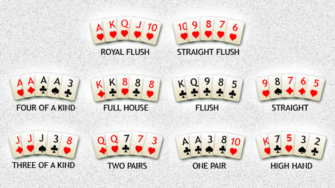

# POKER<i>ist</i>ARS

Este projeto consiste na criação de um programa realizado em linguagem C que faça leitura e processamento de acordo com regras determinadas pelos docentes de mãos usadas no Poker em diferentes modos de jogo.

# O Projeto

Consiste basicamente em uma versão adaptada do jogo de Poker. Neste sentido, o programa trabalhará sempre com o baralho padrão de 52 cartas, com 4 naipes. Além disso, são usadas as regras de mão do estilo Texas Hold'Em e utilizada a classificação mais comum das mão possíveis, sendo como na seguinte imagem:



As regras especiais utilizadas neste projeto serão detalhadas de acordo com o modo de jogo definido, o que será abordado mais adiante.

# Funcionamento

O jogo será executado por completo no Terminal, usando linhas de comando, como determinam os docentes da UC. A invocação pela linha de comando deve ser nos moldes de:

```$ ./pokeristars [OPTION] ... [FILE]```

Onde:

```pokeristars``` é o nome do executável

```[OPTION]``` designa a possibilidade de o programa ser invocado com diferentes opções de funcionamento, dentre elas

```[FILE]``` designa a possibilidade de o programa ter de operar sobre algum ficheiro

Dentro das opções de invocação do programa encontram-se os modos de jogo, as opções disponíveis para realizar a chamada do programa são:

- ```-c``` identifica modo linha de comando;

- ```-d1``` identifica modo ficheiro de baralho #1;

- ```-d2``` identifica modo ficheiro de baralho #2;

- ```-d3``` identifica modo ficheiro de baralho #3;

- ```-d4``` identifica modo ficheiro de baralho #4;

- ```-dx``` identifica modo ficheiro de baralho extra;

- ```-s1``` identifica modo ficheiro de <i>shuffling</i>;

- ```-o``` identifica o modo de escrita de dados em ficheiro.

Por cada invocação do programa apenas uma das 7 primeiras opções acima indicadas poderá ser usada. A opção -o, para escrever a saı́da em ficheiro, não é válida quando se usa a opção -c. Ou seja, o modo linha de comando produz sempre saı́da para ```stdout```.

# Modos de Jogo

O programa a ser realizado possui alguns diferentes modos para ser executado, nomeadamente:

1. Linha de comando
2. Modo de ficheiro de baralho
3. Modo de ficheiro de baralho extra
4. Modo de ficheiro de "shuffling"

## Linha de comando ```[-c]```

Este modo corresponde à opção ```-c``` onde deverão ser indicadas logo em seguida 5, 7, 9 ou 10 cartas, as quais cada quantidade indicada representa uma forma diferente de processamento.

<dl>
    <dt>1. 5 cartas</dt>
	<dd> Ao serem indicadas 5 cartas, o programa deve classificar qual a mão existente.
	</dd>
    <dt>2. 7 cartas</dt>
        <dd> Deve-se indicar o melhor conjunto de 5 cartas entre as 7 e classifica a mão.
	</dd>
    <dt>2. 9 cartas</dt>
        <dd> Assim como no item anterior, indica o melhor conjunto de 5 cartas considerando 2 cartas individuais para um jogador, 2 cartas de outro jogador e 5 cartas da mesa. Após isto é necessário confrontar as mãos e determinar o resultado como no item seguinte.
	</dd>
    <dt>2. 10 cartas</dt>
        <dd> São lidos 2 blocos de 5 cartas, representando 2 mãos diferentes que devem ser confrontadas. Deste modo, o output será:
		<dd>0 - Empate</dd>
		<dd>1 - Primeiras 5 cartas vencem</dd>
		<dd>2 - Últimas 5 cartas vencem</dd>
	</dd>
</dl>
